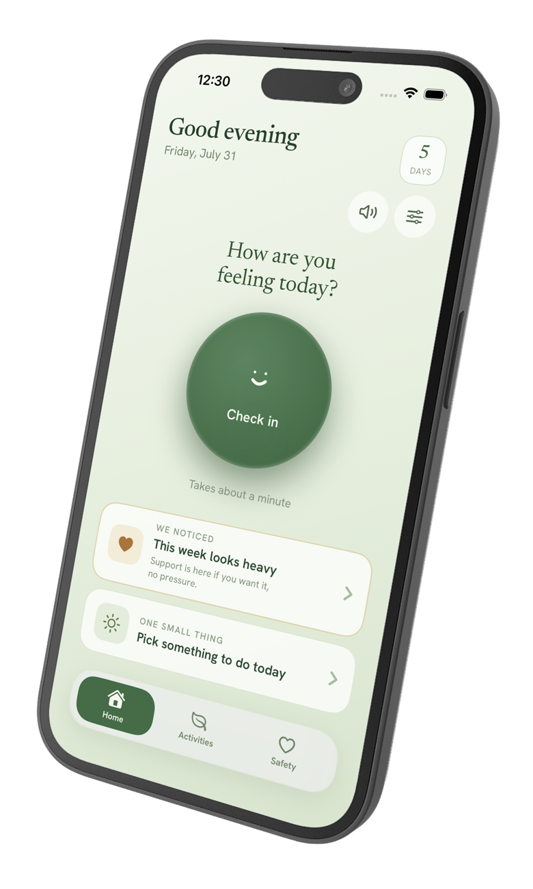
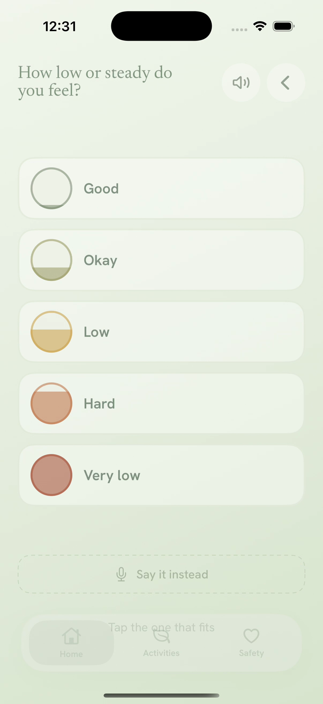
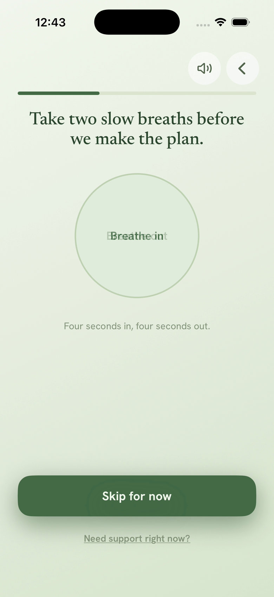
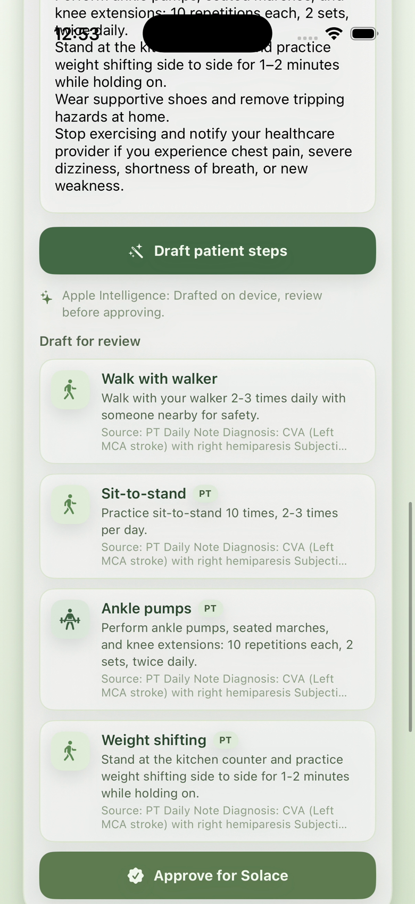

# Solace

Solace is an accessibility-first iOS companion for people recovering from a
stroke. It turns a one-minute check-in into a small, manageable next step, while
CareBridge gives a care partner a clear view of progress and an easy way to
shape the daily plan.

Built in SwiftUI as two coordinated apps:

- **Solace** — the survivor-facing check-in, activity, safety, and recovery app.
- **SolaceCare** — the care-partner app for check-in history, care-plan steps,
  pairing, and shareable updates.

## Product tour

<table>
  <tr>
    <td align="center"><br><sub>Solace home</sub></td>
    <td align="center"><br><sub>Low-friction check-in</sub></td>
  </tr>
  <tr>
    <td align="center"><br><sub>One Small Plan</sub></td>
    <td align="center"><br><sub>CareBridge note-to-steps</sub></td>
  </tr>
</table>

## Highlights

- **A calm daily loop:** mood and energy check-ins require no typing, then
  activities are ordered around the person’s values and available energy.
- **Behavioral activation:** small, values-based actions turn a check-in into
  momentum, with a short after-activity reflection to show what helped.
- **One Small Plan:** a guided single-session intervention helps the survivor
  name a hope, choose two realistic actions, plan around an obstacle, and share
  the finished plan with consent.
- **CareBridge:** paste a physical-therapy or clinical note, draft plain-language
  patient steps on device, review and approve them, then arrange the daily five.
  Approved steps can be exported as a care summary or shareable update.
- **Accessibility throughout:** voice-only interaction, answer matching for
  spoken responses, natural read-aloud voice support, one-hand mirroring,
  visual-neglect anchoring, large targets, simple language, haptics, and
  reduced-motion support.
- **Connected when available:** Firebase sync connects the two apps across
  devices, while a local cache keeps the core workflow available offline.

## Native accessibility release

The current native iOS release makes the app's adaptive behavior visible and
consistent: Settings shows an at-a-glance access profile, screen navigation
uses calm directional transitions, Reduce Motion disables movement and press
scaling, and VoiceOver receives explicit state and action descriptions. These
changes are implemented in the SwiftUI app, not only in the browser demo.

## Browser demo

For a no-install product tour, open the
**[live Solace browser demo](https://sherron-t.github.io/Solace/)**.
It lets judges try the survivor check-in, One Small Plan, accessibility
controls, safety pathway, and CareBridge note-to-steps flow from any modern
browser. The demo uses local browser state; Firebase sync remains part of the
native iOS implementation.

## How the apps connect

```text
Solace ── pairing code ── Firebase Auth + Firestore ── SolaceCare
  │                                                   │
  └──── local cache / App Group fallback ────────────┘
```

## Project structure

| Directory or file | Purpose |
| --- | --- |
| `Solace/` | Survivor-facing SwiftUI app |
| `SolaceCare/` | Care-partner SwiftUI app |
| `Shared/` | Shared models, local persistence, pairing, and Firebase sync |
| `SolaceTests/` | Unit tests for app and care-plan behavior |
| `firestore.rules` | Firestore access rules for paired devices |
| `FIREBASE_SETUP.md` | Firebase configuration and device-pairing notes |
